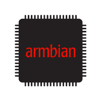

    

    <strong>
        LinuxMirrors
    </strong>

    GNU/Linux 更换系统软件源脚本及 Docker 安装脚本

    <strong>
        <a href="https://linuxmirrors.cn" style="text-decoration: none;">官方网站</a>
    </strong>

<table align="center">
    <tr>
        <td>&nbsp;Debian</td>
        <td align="center">8 ~ 13</td>
    </tr>
    <tr>
        <td>&nbsp;Ubuntu</td>
        <td align="center">14 ~ 24</td>
    </tr>
    <tr>
        <td>&nbsp;Kali Linux</td>
        <td align="center">all</td>
    </tr>
    <tr>
        <td>&nbsp;Linux Mint</td>
        <td align="center">19 ~ 22 / LMDE 6</td>
    </tr>
    <tr>
        <td>&nbsp;Deepin（深度）</td>
        <td align="center">all</td>
    </tr>
    <tr>
        <td>&nbsp;Zorin OS</td>
        <td align="center">all</td>
    </tr>
    <tr>
        <td>&nbsp;Armbian</td>
        <td align="center">all</td>
    </tr>
    <tr>
        <td>&nbsp;Proxmox</td>
        <td align="center">all</td>
    </tr>
    <tr>
        <td>&nbsp;Red Hat Enterprise Linux</td>
        <td align="center">7 ~ 9</td>
    </tr>
    <tr>
        <td>&nbsp;Fedora</td>
        <td align="center">30 ~ 41</td>
    </tr>
    <tr>
        <td>&nbsp;CentOS</td>
        <td align="center">7 ~ 8 / Stream 8 ~ 9</td>
    </tr>
    <tr>
        <td>&nbsp;Rocky Linux</td>
        <td align="center">8 ~ 9</td>
    </tr>
    <tr>
        <td>&nbsp;AlmaLinux</td>
        <td align="center">8 ~ 9</td>
    </tr>
    <tr>
        <td>&nbsp;openEuler（开源欧拉）</td>
        <td align="center">21 ~ 24</td>
    </tr>
    <tr>
        <td>&nbsp;OpenCloudOS（鸥栖）</td>
        <td align="center">8.6 ~ 9 / Stream 23</td>
    </tr>
    <tr>
        <td>&nbsp;openKylin（开放麒麟）</td>
        <td align="center">all</td>
    </tr>
    <tr>
        <td>&nbsp;Anolis OS（龙蜥）</td>
        <td align="center">8 / 23</td>
    </tr>
    <tr>
        <td>&nbsp;openSUSE</td>
        <td align="center">Leep 15 / Tumbleweed</td>
    </tr>
    <tr>
        <td>&nbsp;Arch Linux</td>
        <td align="center">all</td>
    </tr>
    <tr>
        <td>&nbsp;Alpine Linux</td>
        <td align="center">v3 / edge</td>
    </tr>
    <tr>
        <td>&nbsp;Gentoo</td>
        <td align="center">all</td>
    </tr>
</table>

    <strong>
        <a href="https://linuxmirrors.cn/use" style="text-decoration: none;">使用方法</a>&nbsp;&nbsp;&nbsp;&nbsp;<a href="https://linuxmirrors.cn/mirrors" style="text-decoration: none;">软件源列表</a>&nbsp;&nbsp;&nbsp;&nbsp;<a href="https://linuxmirrors.cn/other" style="text-decoration: none;">Docker 安装(额外脚本)</a>
    </strong>

***

这是一个完全开源的非盈利项目，旨在为从事计算机相关行业的朋友们提供便利，使换源更简单

### LICENSE

Copyright © 2024, [SuperManito](https://github.com/SuperManito). Released under the [MIT](https://github.com/SuperManito/LinuxMirrors/blob/main/LICENSE).

<a href="https://star-history.com/#SuperManito/LinuxMirrors&Date">
 <picture>
   <source media="(prefers-color-scheme: dark)" srcset="https://api.star-history.com/svg?repos=SuperManito/LinuxMirrors&type=Date&theme=dark" />
   <source media="(prefers-color-scheme: light)" srcset="https://api.star-history.com/svg?repos=SuperManito/LinuxMirrors&type=Date" />
   
 </picture>
</a>

__如果您觉得这个项目不错对您有所帮助的话，方便在右上角给颗 ⭐ 并分享给更多的朋友吗？__
